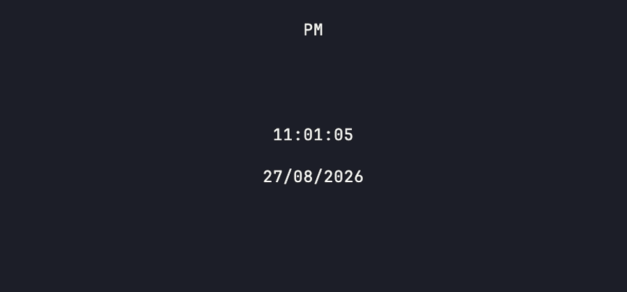

# tclok

[](https://github.com/matheuseabra/tclok/actions/workflows/ci.yml)
[](https://github.com/matheuseabra/tclok/releases)
[](LICENSE)



A dependency-free, resize-responsive terminal clock for modern panes.

```sh
brew install matheuseabra/tap/tclok
tclok
```

## Install

```sh
brew install matheuseabra/tap/tclok
# Or build the current main branch with Cargo:
cargo install --git https://github.com/matheuseabra/tclok.git tclok
```

## Usage

```text
tclok [--12h|--24h] [--seconds|--no-seconds] [--color <#RGB|#RRGGBB>]
```

`tclok` redraws on resize, uses the alternate screen, and prints one plain timestamp when stdout is redirected.

The clock inherits the terminal's ANSI foreground color by default. Override it with a CSS-style hex color, for example `tclok --color=#7aa2f7`.

On macOS Ghostty with an installed `FiraCode-Bold` font, the large clock is rendered through Kitty graphics. At 10+ rows it includes a `DD/MM/YYYY` date; narrower panes remove seconds before using the text fallback.

## Support

64-bit macOS and glibc Linux, UTF-8, xterm-compatible terminals. `TERM=dumb`, Windows, and legacy terminals are out of scope.

## Development

```sh
cargo fmt --check
cargo test
cargo clippy --all-targets -- -D warnings
cargo package --allow-dirty
```

MIT licensed. See [release notes and packaging](docs/releasing.md).
